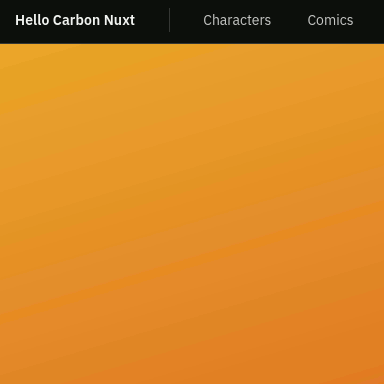

# Hello carbon nuxt
This repository is designed to help you get started with integrating Carbon into a Nuxt application.
It showcases best practices for setting up a new Nuxt app with Carbon, providing a solid foundation
for your project.

If you are looking for a plain Vue 3 example, checkout [Hello carbon Vue3](https://github.com/IBM/hello-carbon-vue3)

## Packages used
- [Carbon for Vue 3](https://vue.carbondesignsystem.com/?path=/docs/welcome--vue-3-carbon-10) - Vue implementation of
the Carbon Design System A collection of Carbon Components
- [Nuxt](https://nuxt.com/) - The Intuitive Vue Framework
- [@nuxtjs/i18n](https://i18n.nuxtjs.org/) - This repository demonstrates how to implement translations using
`@nuxtjs/i18n`. All user interface (UI) elements and the majority of the content have been translated.
- [@sidebase/nuxt-auth](https://auth.sidebase.io/) - User authentication and sessions via authjs
- [@nuxtjs/tailwindcss](https://tailwindcss.nuxtjs.org/) - Tailwind CSS with custom Carbon colors
- [winston](https://github.com/IBM/hello-carbon-vue3?tab=readme-ov-file) - A logger for just about everything
- [Husky](https://www.npmjs.com/package/husky) - pre-commit hooks
- [lint-staged](https://www.npmjs.com/package/lint-staged) - Run linters against staged git files
- [commit-lint](https://commitlint.js.org/#/)- Helps your team adhere to a commit convention
- [cypress](https://www.cypress.io/) - Implement e2e tests with cypress to help screen PRs

## Carbon styles
The carbon styles are imported as a pre-compiled css file. The fie is created by using sass on the command line to
generate the css. See [carbon-gray-90.scss](assets/scss/carbon-gray-90.scss) for instructions on creating the css file.

## Pages & Components
[Demo site for this repository](https://example.com)
- Header with mobile navigation under "hamburger" menu

  
  - Language selection in the header bar, login and switcher buttons are also included
  - The login works with IBMid and other providers from next-auth
- Home page
  - cv-grid,cv-row,cv-column
  - auth demo login with `useAuth()`, `getProviders`, and `status`
- Characters page
  - cv-accordion with auth close function
  - tailwind custom color for title
- Comics page
  - cv-tile, cv-modal
- Events page
  - Fully translatable data table including controls and aria labels
  - Slotted data & headings
  - Searchable data
  - cv-data-table, cv-data-table-action, cv-data-table-heading
  - cv-data-table-row (expandable rows), cv-data-table-cell
  - cv-button, cv-toggle
  - REST API integrated with table paging
- Page transitions
  - cv-loading
- Server side
  - REST api calls with authentication check and caching of results
  - middleware logging with `winston`

## 🎨 Calling All UX Designers!

Hey there, creative geniuses! Are you a UX designer who loves to experiment, ideate, and bring 
interfaces to life? Well, guess what? You're more than welcome to join the fun here!

This project is a showcase for Carbon components with Nuxt, so the only guideline is to highlight 
those amazing components in your designs. Whether you:

- Want to revamp the UI/UX for a smoother user experience,
- Have creative ideas for showcasing Carbon components in unique ways,
- Think the layout could use a bit more flair,
- Or simply want to experiment and have fun...

You're in the right place!

No suggestion is too wild, and no contribution is too small. Go open a pull request or just open an issue with a Figma
link, let your imagination run wild with the Carbon components. We’re here for brainstorming, prototyping, and
pixel-perfect designs (or not-so-perfect ones—we’re cool with that too).

## Prereqs
- [nvm](https://github.com/nvm-sh/nvm?tab=readme-ov-file#installing-and-updating)
- Node v22 `nvm install 22`
- [Mockoon](https://mockoon.com/download/) - run mocks for comics endpoints
- Docker or [podman](https://podman.io/) or [Rancher Desktop](https://rancherdesktop.io/)

## Setup

Make sure to install the dependencies:

```bash
# npm
npm install
```

## Getting Started

A mock version of the comics endpoints is in [mock-api.json](./local-dev/mock/mock-api.json).
Load this in the Mockoon desktop app or start in the command line.
```shell
npm install -g @mockoon/cli
mockoon-cli start --data ./local-dev/mock/mock-api.json

```

## Set up the authentication (local mock)
```shell
cd local-dev
docker compose up
```
This will launch a local openid [keycloak](https://www.keycloak.org/getting-started/getting-started-docker) server and allow you to log in with admin/potato-history

Copy `.env.example` to `.env`
```shell
cp .env.example .env
```
Edit `.env` and change any values for your system

## Start the development server on

```bash
# npm
npm run dev
```
Server should be running at http://localhost:4507


Log in with admin/potato-history

## Production

Build the application for production:

```bash
# npm
npm run build
```

Locally preview production build:

```bash
# npm
npm run preview
```

Check out the [deployment documentation](https://nuxt.com/docs/getting-started/deployment) for more information.

## Set environment vars on the deployed system
```dotenv
MARVEL_APIKEY=Your Marvel api key from https://developer.marvel.com/
MARVEL_PRIVATE_KEY=Your Marvel secret key from https://developer.marvel.com/
MARVEL_URL=https://gateway.marvel.com/
NUXT_AUTH_SECRET=set to a long string
AUTH_CLIENT_ID=Login provider client id
AUTH_CLIENT_SECRET=Login provider client secret
```
