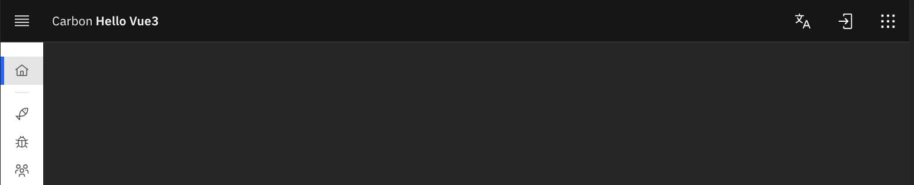

# Hello carbon vue3

This repo should help you get started with using Carbon with Vue3. The idea is that this app uses the best practices for starting a new app with Vue3 & Carbon.

## Packages used

- Carbon Vue3 - beta 0.0.6 (many components are still missing)
- [Vite](https://vitejs.dev/) - this seems to be the default for new Vue3 projects instead of WebPack
- [Pinia](https://pinia.vuejs.org/) - this replaces Vuex store
- [i18next](https://www.i18next.com/) - this repo demonstrates how to include translations using i18next. All UI elements are translated and most content is translated.
- [superagent](https://www.npmjs.com/package/superagent) - I like this package better than axios and use it here to demo making REST calls
- [v-lazy-image](https://www.npmjs.com/package/v-lazy-image) - All images are lazy loaded via this package
- [Husky](https://www.npmjs.com/package/husky) - pre-commit hooks
- [lint-staged](https://www.npmjs.com/package/lint-staged) - Run linters against staged git files
- [commit-lint](https://commitlint.js.org/#/) - Helps your team adhere to a commit convention

## Pages & Components

[This repo demo site](https://ibm.github.io/hello-carbon-vue3/)

- Header with Side nav 
  - Side nav with divider
  - Language selection in the header bar, login and switcher buttons are also included
- Home page
  - cv-grid,cv-row,cv-column
  - cv-aspect-ratio
  - REST API examples integrated with Pinia store
- Fish page
  - Fully translatable data table including controls and aria labels
  - Slotted data & headings
  - Searchable data
  - cv-data-table-skeleton
  - cv-data-table
  - cv-data-table-action, cv-data-table-heading
  - cv-data-table-row, cv-data-table-cell
  - cv-button
  - REST API examples integrated with Pinia store
- Bugs page
  - cv-accordion-skeleton
  - cv-accordion, cv-accordion-item
  - cv-tag
  - cv-icon-button
  - slotted title and content for accordion
  - REST API examples integrated with Pinia store
  - Fun 3D card flipper css
- Villagers page
  - cv-content-switcher, cv-content-switcher-button
  - cv-content-switcher-content
  - REST API examples integrated with Pinia store
  - Fun animated icons & chat bubbles

## Coding guide

- [Vue style guide](https://vuejs.org/style-guide/) The style guide is followed, but I do not know of a linter that finds style issues which means there are likely places I have missed to follow the guide. If you find something wrong, please fix it.
- Prettier and eslint rules are enforced as pre-commit hooks via husky.

## Recommended IDE Setup

[WebStorm](https://www.jetbrains.com/webstorm/)

[VSCode](https://code.visualstudio.com/) + [Volar](https://marketplace.visualstudio.com/items?itemName=Vue.volar) (and disable Vetur) + [TypeScript Vue Plugin (Volar)](https://marketplace.visualstudio.com/items?itemName=Vue.vscode-typescript-vue-plugin).

## Project Setup

```sh
nvm use 18
npm add -g pnpm
pnpm install
```

### Compile and Hot-Reload for Development

```sh
pnpm run dev
```

### Compile and Minify for Production

```sh
pnpm run build
```

### Run Unit Tests with [Vitest](https://vitest.dev/)

```sh
pnpm run test:unit
```

### Lint with [ESLint](https://eslint.org/)

```sh
pnpm run lint
```

## Update dependencies

```shell
pnpm update --interactive
```
